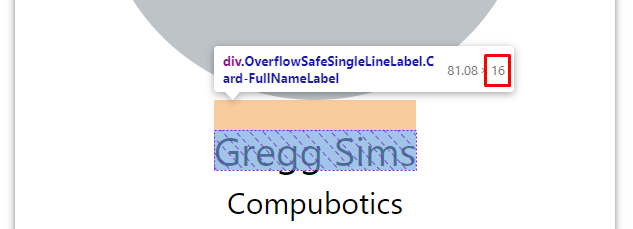

# OverflowSafeSingleLineLabel

[](https://plugins.jetbrains.com/plugin/17677-yamato-daiwa-frontend)

Improved solution of [horizontal text overflow safety of single line labels](https://stackoverflow.com/q/68667208/4818123)
problem. The component. Recommended to use when single line label's height wanted to be equal to font size, but be 
overflow-safe and all hanging symbols like *g* or *h* be fully visible.


## Quick example


```pug
.Example1

  .Card
    .Card-Avatar
    +OverflowSafeSingleLineLabel.Card-FullNameLabel Gregg Sims
    +OverflowSafeSingleLineLabel.Card-OrganizationNameLabel Compubotics
    .Card-Description

  .Card
    .Card-Avatar
    +OverflowSafeSingleLineLabel.Card-FullNameLabel= textOverflowSafetyTest
    +OverflowSafeSingleLineLabel.Card-OrganizationNameLabel= textOverflowSafetyTest
    .Card-Description
```

```stylus
@require "../PATH/TO/node_modules/@yamato-daiwa/frontend/Functionality.styl"
@require "../PATH/TO/node_modules/@yamato-daiwa/frontend/Components.styl"


CrossBrowserStylesReset()
InitialGlobalCSS_Rules()


provideOverflowSafeSingleLineLabelComponent()


.Example1

  display flex
  column-gap 24px

  padding 16px 16px 0


  >*

    CARD_FIXED_WIDTH = 240px

    flex 0 0 CARD_FIXED_WIDTH
    max-width CARD_FIXED_WIDTH
    

.Card

  display flex
  flex-direction column
  align-items center

  height 320px
  padding 6px 12px 12px

  background white;
  box-shadow 0 0 3px rgba(0, 0, 0, 0.5);


  &-Avatar

    width 80%
    aspect-ratio 1/1
    border-radius 50%

    background #bdc3c7

    flex-shrink 0


  &-FullNameLabel

    OverflowSafeSingleLineLabel({
      fontSize: 16px,
      displayEllipsis: true
    })

    margin-top 12px


  &-OrganizationNameLabel

    OverflowSafeSingleLineLabel({
      fontSize: 12px,
      displayEllipsis: true
    })

    margin-top 6px


  &-Description

    height 120px
    border-radius 8px

    align-self stretch

    background #ecf0f1

    margin-top 16px
```

Both `.Card-FullNameLabel` and `.Card-OrganizationNameLabel` has same height as theirs font-size:




### Usage

#### Markup (Pug)

Make sure that you have included `Components.pug` from the library.

```pug
include ../PAHTH/TO/node_modules/Components.pug
```

Some CSS class must be assigned to `OverflowSafeSingleLineLabel` mixin for the styles setup:

```pug
+OverflowSafeSingleLineLabel.ExampleLabel Text goes here
```


#### Styles (Stylus)

Make sure that you have required the `Functionlity.styl` and `Components.styl` from the library.

```stylus
@require "../../../../Functionality.styl"
@require "../../../../Components.styl"
```

Note that just these requires will not produce any CSS.

`OverflowSafeSingleLineLabel` component has **common** and **individual** styles.
To provide the common styles, call below function:

```stylus
provideOverflowSafeSingleLineLabelComponent()
```

Then apply the individual styles to desired selector by mixin `OverflowSafeSingleLineLabel`: 

```stylus
.ExampleLabel

  OverflowSafeSingleLineLabel({
    fontSize: 12px,
    displayEllipsis: true
  })
```

#### Caveats

##### CSS grid

Unfortunately, for the grid layout (`display: grid / inline-grid`) it's also required to adapt this layout.

In below example, `1fr` means `minmax(auto, 1fr)`, so the overflowed item overflow the grid parent.

```stylus
.GridLayout

  display grid
  grid-template-columns repeat(5, 1fr)
```

One way to fix it is

```stylus
.GridLayout

  display grid
  grid-template-columns repeat(5, minmax(0, 1fr))
```

It also could be other minimal width of the item instead of `0`

Check below sources for the details and other solutions;.


* [Prevent content from expanding grid items - Stack Overflow](https://stackoverflow.com/a/43312314/4818123)
* [Why does minmax(0, 1fr) work for long elements while 1fr doesn't? - Stack Overflow](https://stackoverflow.com/q/52861086/4818123)
* [Reconsider the meaning of 1fr - Git Hub](https://github.com/w3c/csswg-drafts/issues/1777)
* [Prevent grid area from expanding causing whole page to scroll](https://stackoverflow.com/q/52785750/4818123)


### API

#### Markup (Pug)

```
+OverflowSafeSingleLineLabel({
  rootElementTag?: string = "div"
})
```


#### Styles (Stylus)

```
OverflowSafeSingleLineLabel({
  fontSize: DataTypes.unit;
  lineHeight?: DataTypes.unit = 1.4
  displayEllipsis?: DataTypes.boolean = true
})
```
