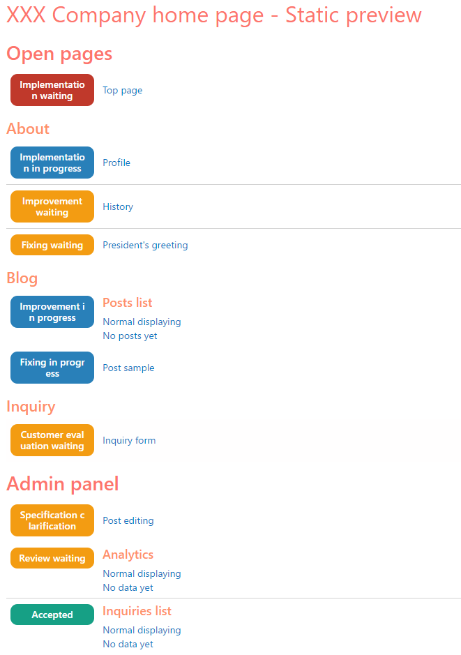

# Static preview anywhere page

## The concept of Static Preview

### Problem

Although "Markup and styles in JavaScript" is a popular methodology, it has serious issues.

1. **State-dependent rendering**. For example, if there are not enough items in the data source, no pagination will be displayed, trus you can't give the feedback then modifying the markup or styles of the pagination).
2. **Limited page access**. For example, you can not give the feedback when writing the markup and styles for the admin panel until don't authorize. Even if you will implement the authorization after writing the markup, you may need to modify the admin panel after application realize.
3. The JavaScript-powered applications usually requires the development server for normal operation which makes hard the demonstration of the progress to customers.
4. The human can not focus on markup, styles and logic simultaneously. Are markup and CSS in JavaScript or not, the developer can not write them at the same time.

Especially, once minimal working application will be done and realized, the changing of the markup and styles in the pages like "Thank you for the purchasing!" could be really hard - once page will be realoaded, normally user will be redirected to avoid the double scoring of the conversion.

### Solution

The **static preview** is the web-page development stage on which the engineer is focusing on markup and styles, herewith:

1. The states like loading or error could be simulated by [conditional rendering of Pug](https://pugjs.org/language/conditionals.html).
2. The dummy data could be generated by build-in JavaScript of Pug (and also, some functionality of `@yamato-daiwa/es-extensions`
   including random values generators is available).
3. All pages could be accessed without limitations like authorization (of course, no actual or sensitive data must be in this stage.)
4. No development server required for the viewing of the output files: the customer can just open these files in browser and see the content.

But another one feature of this methodology is **(static preview) anywhere page**.
In fact, it is the main HTML file with the list of links of each page (by other words, **table of contents**).
Thanks to it, the customer can open just this HTML file and watch any page.

Please note that:

* The **static preview** including **anywhere page** is **for development and progress reporting needs only** and **must NOT be published**.
* The markup and styles created in this stage will be re-used in the next stage of development, but the static preview *itself*
  is only for the developers and their customers.

## Quick example



```pug
extends ../../node_modules/@yamato-daiwa/frontend/PagesTemplates/StaticPreviewAnywherePage.pug
//- ↑ In your project structure, the relative path to node_module may be different

block append Metadata

  - HTML_PAGE_TITLE = "XXX Company home page - Static preview";


block append TableOfContents

  h1.AnywherePage-TopHeading= HTML_PAGE_TITLE

  h2.AnywherePage-PagesGroupHeading Open pages

  +PageLink({
    label: "Top page",
    URI: "Open/TopPage.html",
    progressStatus: StaticPreviewAnywherePage.PageDevelopmentProgressStatuses.implementationWaiting
  })

  h3.AnywherePage-PagesSubgroupHeading About

  +PageLink({
    label: "Profile",
    URI: "Open/About/ProfilePage.html",
    progressStatus: StaticPreviewAnywherePage.PageDevelopmentProgressStatuses.implementationInProgress
  })

  +PageLink({
    label: "History",
    URI: "Open/About/HistoryPage.html",
    progressStatus: StaticPreviewAnywherePage.PageDevelopmentProgressStatuses.improvementWaiting
  })

  +PageLink({
    label: "President's greeting",
    URI: "Open/About/President_sGreetingPage.html",
    progressStatus: StaticPreviewAnywherePage.PageDevelopmentProgressStatuses.fixingWaiting
  })

  h3.AnywherePage-PagesSubgroupHeading Blog

  +PageLinksGroup({
    title: "Posts list",
    linksData: [
      { label: "Normal displaying", URI: "Open/Blog/PostsListPage.html" },
      { label: "No posts yet", URI: "Open/Blog/PostsListPage-NoPosts.html" }
    ],
    progressStatus: StaticPreviewAnywherePage.PageDevelopmentProgressStatuses.improvementInProgress
  })

  +PageLink({
    label: "Post sample",
    URI: "Open/Blog/PostSamplePage.html",
    progressStatus: StaticPreviewAnywherePage.PageDevelopmentProgressStatuses.fixingInProgress
  })

  h3.AnywherePage-PagesSubgroupHeading Inquiry

  +PageLink({
    label: "Inquiry form",
    URI: "Open/InquiryPage.html",
    progressStatus: StaticPreviewAnywherePage.PageDevelopmentProgressStatuses.customerEvaluationWaiting
  })


  h2.AnywherePage-PagesGroupHeading Admin panel

  +PageLink({
    label: "Post editing",
    URI: "Admin/Blog/PostEditingPage.html",
    progressStatus: StaticPreviewAnywherePage.PageDevelopmentProgressStatuses.specificationClarification
  })

  +PageLinksGroup({
    title: "Analytics",
    linksData: [
      { label: "Normal displaying", URI: "Admin/Analytics/AnalyticsPage.html" },
      { label: "No data yet", URI: "AdminPanel/Analytics/AnalyticsPage-NoData.html" }
    ],
    progressStatus: StaticPreviewAnywherePage.PageDevelopmentProgressStatuses.reviewWaiting
  })

  +PageLinksGroup({
    title: "Inquiries list",
    linksData: [
      { label: "Normal displaying", URI: "Admin/Inquiries/InquiriesListPage.html" },
      { label: "No data yet", URI: "Admin/Inquiries/InquiriesListPage-NoData.html" }
    ],
    progressStatus: StaticPreviewAnywherePage.PageDevelopmentProgressStatuses.accepted
  })
```

## How to create the Static preview anywhere page
### Step 1: Prepare the directory and files

Create the directories for static preview: one for the source files and one for the output files.

### Step 2: Create the Pug file for Static Preview anywhere page

You can name this file as `index.pug` or any other name if your project building tool is able to find this file and open
compiled HTML in the browser.

### Step 3: Extend the `PagesTemplates/StaticPreviewAnywherePage.pug`

In your project, the relative path to `node_modules` could be different.

```pug
extends ../node_modules/@yamato-daiwa/frontend/PagesTemplates/StaticPreviewAnywherePage.pug
```

### Step 4: Fill the `Metadata` block

The **StaticPreviewAnywherePage.pug** is extended from [**RegularWebPage.pug**](./../RegularWebPage.md), so all it's
pre-defined blocks are available.

You may need to set the language of HTML document if your language is not English or change the `title` of HTML page.

```pug
block append Metadata

  -
    HTML_PAGE_LANGUAGE = "ja";
    HTML_PAGE_TITLE = "やまとダイワ電子雑誌 | 静的プレビュー";
```

### Step 5: Fill the `TableOfContents` block

There are some [Pug mixins](https://pugjs.org/language/mixins.html) for links to other pages has been prepared
(see [Pre-made mixins section](#pre-made-mixins)). You may also to add some headings to split the pages to groups -
see [Headings](#headings) section.

All styles are pre-made and included as [internal CSS](https://www.w3schools.com/css/css_howto.asp) to the output HTML file.


## Pre-made mixins

### `PageLink`

[](https://plugins.jetbrains.com/plugin/17677-yamato-daiwa-frontend)

```
PageLink(parametersObject: {
  label: string;
  URI: string;
  progressStatus: StaticPreviewAnywherePage.PageDevelopmentProgressStatuses;
})

enum StaticPreviewAnywherePage.PageDevelopmentProgressStatuses {

  implementationWaiting: "IMPLEMENTATION_WAITING",
  implementationInProgress: "IMPLEMENTATION_IN_PROGRESS",

  improvementWaiting: "IMPROVEMENT_WAITING",
  improvementInProgress: "IMPROVEMENT_IN_PROGRESS",

  fixingWaiting: "FIXING_WAITING",
  fixingInProgress: "FIXING_IN_PROGRESS",

  specificationClarification: "SPECIFICATION_CLARIFICATION",

  reviewWaiting: "REVIEW_WAITING",
  customerEvaluationWaiting: "CUSTOMER_EVALUATION_WAITING",

  accepted: "ACCEPTED"
}
```

The link to single HTML page with relative path `URI`.

* Title this page with `label`.
* Specify `progressStatus` with one element of `PageDevelopmentProgressStatuses` enumeration.

Please note that static preview anywhere page is not intended to be used as tool for the management - the role 
`progressStatus` is just to inform you customer or boss like "This page is still in progress, please don't evaluate it yet" 
(`implementationInProgress`) or "You are already accepted this page" (`accepted`).

#### `PageLinksGroup`

[](https://plugins.jetbrains.com/plugin/17677-yamato-daiwa-frontend)

```
PageLinksGroup(parametersObject: {
  title: string;
  linksData: Array<LinkData>;
  progressStatus: PageDevelopmentProgressStatuses;
})

LinkData {
  label: string;
  URI: string;
}
```

As it has been told above, at static preview stage the states like loading or error could be simulated by 
[conditional rendering of Pug](https://pugjs.org/language/conditionals.html). To display all of these states to reviewer
at static preview stage, the separate HTML file for each of these states is required, but it does not mean what you need
to copy-paste the markup of the whole page and replace the markup of the loading state to the markup of the error state - 
using of the inheriting and variables functionality of Pug pre-processor allows to avoid it.

The `PageLinksGroup` is intended to be used for single page represented with multiple states:

```pug
PageLinksGroup({
  title: "Users list",
  linksData: [
    { label: "Regular view", URI: "Users/List/UsersListPage-RegularView.html" },
    { label: "Loading", URI: "Users/List/UsersListPage-Loading.html" },
    { label: "Error", URI: "Users/List/UsersListPage-Error.html" },
    { label: "No items", URI: "Users/List/UsersListPage-NoItems.html" }
  ],
  progressStatus: StaticPreviewAnywherePage.PageDevelopmentProgressStatuses.implementationInProgress
})
```

## Headings CSS classes

* `.AnywherePage-TopHeading` Intended to be filled with application name. You may reuse `HTML_PAGE_TITLE` variable for this heading.
* `.AnywherePage-TopSubheading` Intended to be filled with some kind of clarification or application slogan. You can skip it 
   if you have no idea about this subheading's text.

All of below headings are just for the organizing of `PageLink`s and `PageLinksGroup`s.

* `.AnywherePage-PagesGroupHeading`
* `.AnywherePage-PagesSubgroupHeading`
* `.AnywherePage-PageSubsubgroupHeading`

The usage could be something like:


```pug
h2.AnywherePage-PagesGroupHeading Admin panel
h3.AnywherePage-PagesSubgroupHeading Entities management

+PageLinksGroup({
  title: "Products management",
  linksData: [
    { label: "Regular view", URI: "Products/ProductsManagementPage-RegularView.html" },
    { label: "Loading", URI: "Products/ProductsManagementPage-Loading.html" },
    { label: "Error", URI: "Products/ProductsManagementPage-Error.html" },
    { label: "No items", URI: "Products/ProductsManagementPage-NoItems.html" }
  ],
  progressStatus: StaticPreviewAnywherePage.PageDevelopmentProgressStatuses.implementationInProgress
})

+PageLink({
  label: "Categories management",
  URI: "Categories/CategoriesManagementPage.html"
  progressStatus: PageDevelopmentProgressStatuses;
})
```


[//]: # (## IntelliJ IDEA files template &#40;official plugin&#41;)

[//]: # ()
[//]: # (With installed [official IntelliJ IDEA plugin]&#40;https://plugins.jetbrains.com/plugin/17677-yamato-daiwa-frontend&#41;, you can quickly)

[//]: # (generate the anywhere page &#40;<kbd>Project</kbd> > <kbd>Right click on directory</kbd> > <kbd>New</kbd> > )

[//]: # (<kbd>Static preview anywhere page"</kbd>&#41;. The content of this file has been fully explained above, but there are a lot)

[//]: # (of hinting comments.)

[//]: # ()
[//]: # ()
[//]: # (## Localization of links' badges)

[//]: # ()
[//]: # (You can localize the badges of pages links in `Metadata` block by `setLocalization` method of `StaticPreviewAnywherePage`)

[//]: # (object:)

[//]: # ()
[//]: # (```jade)

[//]: # (block append Metadata)

[//]: # ()
[//]: # (  -)

[//]: # (    HTML_PAGE_LANGUAGE = "ja";)

[//]: # ()
[//]: # (    StaticPreviewAnywherePage.setLocalization&#40;{)

[//]: # (      progressStatusBadgesText: {)

[//]: # (        [StaticPreviewAnywherePage.PageDevelopmentProgressStatuses.implementationWaiting]: "実装待機",)

[//]: # (        [StaticPreviewAnywherePage.PageDevelopmentProgressStatuses.implementationInProgress]: "実装中",)

[//]: # ()
[//]: # (        [StaticPreviewAnywherePage.PageDevelopmentProgressStatuses.improvementWaiting]: "改良待機",)

[//]: # (        [StaticPreviewAnywherePage.PageDevelopmentProgressStatuses.improvementInProgress]: "改良中",)

[//]: # ()
[//]: # (        [StaticPreviewAnywherePage.PageDevelopmentProgressStatuses.fixingWaiting]: "修正待機",)

[//]: # (        [StaticPreviewAnywherePage.PageDevelopmentProgressStatuses.fixingInProgress]: "修正中",)

[//]: # ()
[//]: # (        [StaticPreviewAnywherePage.PageDevelopmentProgressStatuses.specificationClarification]: "仕様確認中",)

[//]: # (        [StaticPreviewAnywherePage.PageDevelopmentProgressStatuses.reviewWaiting]: "校閲待機",)

[//]: # (        [StaticPreviewAnywherePage.PageDevelopmentProgressStatuses.customerEvaluationWaiting]: "評価中",)

[//]: # (        [StaticPreviewAnywherePage.PageDevelopmentProgressStatuses.accepted]: "承諾済み")

[//]: # (      })

[//]: # (    }&#41;)

[//]: # (```)
