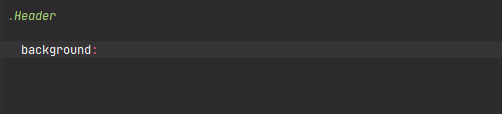

`# PracticalColorCoordinateSystem - Colors of Practical Color Coordinate System (PCCS)

[](https://plugins.jetbrains.com/plugin/17677-yamato-daiwa-frontend)



Provides the colors of Practical Color Coordinate System (PCCS) - the color palette developed by the Japan Color Research Institute.


## Issues
### No reliable sources with exact color codes

Unfortunately, the official sources describes only conception of PCCS, but exact color codes has not being listed.
**PracticalColorCoordinateSystem** including color codes published on [https://www.color-site.com/pccs_tones/dull](color-site.com)
because this source presents maximal colors, however, except shades of gray.

The codes of shades of gray has been took from [garakuta.net](http://www.garakuta.net/color/pccs/index.html).  


### Duplicated color names

The **blue green** and **blue** colors presents in palette twice what breaking the name uniqueness (identifier) conception.
Although **PracticalColorCoordinateSystem.vivid.reddishOrange** looks unique, because of double **blue green** and **blue**
we has been forced to add the number in addition to color name, and now reddish orangle is 
**PracticalColorCoordinateSystem.vivid.reddishOrange4**.
Thanks to it, now we have **PracticalColorCoordinateSystem.vivid.blue17** and **PracticalColorCoordinateSystem.vivid.blue18**
and same for **blueGreen** (has number 14 and 15).


### Seems to be illogical system

Although the designers learning this colors system could explain the PCCS conception exhaustively, at a glance is could 
seem strange.

* **Vivid** tone has 24 color while any other tones has 12 colors and numeration is limited by even number (2, 4, ..., 24).
  [https://www.color-site.com/pccs_tones/dull](color-site.com) provides 24 color for each tone (except grayscale).
* **White** color is not actually #FFF same as **black** color is not #000.

## Usage

```
PracticalColorCoordinateSystem.{TONE}.{COLOR}
```

Where the at the **TONE** placeholder could be

* vivid
* bright
* strong
* deep
* light
* soft
* dull
* dark
* pale
* lightGrayish
* grayish
* darkGrayish
* white
* lightGray8_5
* lightGray7_5
* mediumGray6_5
* mediumGray5_5
* mediumGray4_5
* darkGray3_5
* darkGray2_5
* black

Please note that **COLOR** property is not available for the tones from **white** until **black**.
For any other tones (from **vivid** to **darkGrayish**) at the **COLOR** placeholder cold be:

* purplishRed1
* red2
* yellowishRed3
* reddishOrange4
* orange5
* yellowishOrange6
* reddishYellow7
* yellow8
* greenishYellow9
* yellowGreen10
* yellowishGreen11
* green12
* bluishGreen13
* blueGreen14
* blueGreen15
* geenishBlue16
* blue17
* blue18
* purplishBlue19
* violet20
* bluishPurple21
* purple22
* reddishPurple23
* redPurple24


### Example

```stylus
.Header

  background: PracticalColorCoordinateSystem.pale.orange5


  &-Heading

    color: PracticalColorCoordinateSystem.darkGray2_5
```
