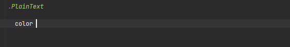

# ShadesOfGray__39ColorsW3C_Palette - Shades of gray (39 colors W3C palette)

[](https://plugins.jetbrains.com/plugin/17677-yamato-daiwa-frontend)



The array of 39 elements including colors of shades of gray palette suggested on [W3C Schools website](https://www.w3schools.com/colors/colors_shades.asp).
Since array elements are being numerated from 0, the first color (black with code `#000`) has number **0** and last
color (white with code `#FFF`) has number **38**. 


## Example

```stylus
.Paragraph
  
  color ShadesOfGray__39ColorsW3C_Palette[2]
```
