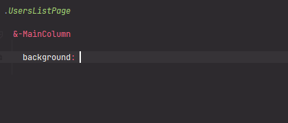

# TemporaryHighlighting - Semitransparent color for temporary highlighting

[](https://plugins.jetbrains.com/plugin/17677-yamato-daiwa-frontend)



Generally most of `div`s, `span`s and other HTML elements has not the visible background and border as default.
Below semitransparent colors allows to visualize the elements boundaries, but those are aimed exclusively for
usage during coding, not for production.

```
TemporaryHighlighting.{TONE}.{OPACITY}
```

Available **TONE** values:

* **red**
* **orange**
* **yellow**
* **green**
* **cyan**
* **blue**
* **magenta**
* **purple**

Available **OPACITY** values:

* **opacity10Percent**
* **opacity25Percent**
* **opacity50Percent**
* **opacity75Percent**


Usage example:

```stylus
.MainLayout
  
  &-MainColumn
    
    background: TemporaryHighlighting.red.opacity10Percent
    
    
  &-Sidebar
    
    background: TemporaryHighlighting.orange.opacity10Percent
```

Please note that in Stylus if CSS value is some value of object (hash), basically colon is required
(see [related issue](https://github.com/stylus/stylus/issues/2558) in GitHub ).
Sometimes it works without colon, but conditions are unclear.
