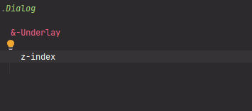

# Basic variables

Below variable should be changes only one time before styles declaration (or should not be changed if you are satisfied
width default values).

## Typography
### Font stacks

| Variable name              | [Type](../../01-Assets/01-FundamentalConstantsAndEnums/FundamentalConstantsAndEnums.md#datatypes---stylus-data-types) | Default value description                                                                 |
|----------------------------|-----------------------------------------------------------------------------------------------------------------------|-------------------------------------------------------------------------------------------|
| MAIN_SANS_SERIF_FONT_STACK | DataTypes.string                                                                                                      | Adopted from [Rebot](https://getbootstrap.com/docs/4.0/content/reboot/#native-font-stack) |
| MAIN_SERIF_FONT_STACK      | DataTypes.string                                                                                                      | Times New Roman based                                                                     |
| MAIN_MONOSPACED_FONT_STACK | DataTypes.string                                                                                                      | Lucida Console based                                                                      |
| MAIN_FONT_STACK            | DataTypes.string                                                                                                      | Refers to **MAIN_SANS_SERIF_FONT_STACK**                                                  |

### Dimensions

All of below variables are being used by [InitialGlobalCSS_Rules](../../02-Kernel/04-StylesInitialization/InitialGlobalCSS_Rules.md) 
mixin which is intended to be applied between [CrossBrowserStylesReset](../../02-Kernel/04-StylesInitialization/CrossBrowserStylesReset.md)
and other styles.

| Variable name                              | [Type](../../01-Assets/01-FundamentalConstantsAndEnums/FundamentalConstantsAndEnums.md#datatypes---stylus-data-types) | Default value |
|--------------------------------------------|-----------------------------------------------------------------------------------------------------------------------|---------------|
| BASIC_FONT_SIZE                            | DataTypes.unit                                                                                                        | `14px`        |
| BASIC_LINE_HEIGHT                          | DataTypes.unit or DataTypes.unitlessNumber                                                                            | `1`           |
| BASIC_FONT_SIZE_IN_MULTILINE_TEXT_BLOCKS   | DataTypes.unit                                                                                                        | `14px`        |
| BASIC_LINE_HEIGHT_IN_MULTILINE_TEXT_BLOCKS | DataTypes.unit or DataTypes.unitlessNumber                                                                            | `1.4`         |

## ZIndexes

The **ZIndexes** is the object. It could not be called "the enumeration" because it is assuming that the values could be
changed and new values could be added.

| Enumerate element                      | Default value |
|----------------------------------------|---------------|
| ZIndexes.floatingNotifications         | 60            |
| ZIndexes.blockingOverlay               | 50            |
| ZIndexes.floatingAboveModalsComponents | 40            |
| ZIndexes.modalsUnderlay                | 30            |
| ZIndexes.floatingBelowModalsComponents | 20            |
| ZIndexes.drawers                       | 10            |
| ZIndexes.lowermostLayer                | 0             |

## BEM Related

✏ [BEM (Block, Element, Modifier)](https://en.bem.info/methodology/) is the methodology of front-end development 
of websites and web applications, mainly focused on CSS classes naming conventions, project structure conventions and
splitting the GUI on components.

Below variables are being used by [buildBEM_ClassName](../07-OtherFunctions/buildBEM_ClassName.md) functions, but elements
and modifier separators could be overwritten.

| Variable name            | [Type](../../01-Assets/01-FundamentalConstantsAndEnums/FundamentalConstantsAndEnums.md#datatypes---stylus-data-types) | Default value |
|--------------------------|-----------------------------------------------------------------------------------------------------------------------|---------------|
| `BEM_ELEMENT_SEPARATOR`  | `DataTypes.string`                                                                                                    | `__`          |
| `BEM_MODIFIER_SEPARATOR` | `DataTypes.string`                                                                                                    | `_`           |
