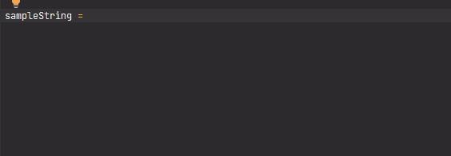

# buildString - build string with interpolation

[](https://plugins.jetbrains.com/plugin/17677-yamato-daiwa-frontend)



```
buildString(template: string, variables: { [key: string]: string | number }): string
```

Allows to build the strings using the syntax similar to [ES6 template literals](https://developer.mozilla.org/en-US/docs/Web/JavaScript/Reference/Template_literals).
However, it's required to pass the second parameters with variables names and values.  

```stylus
p(buildString("Good morning, ${name}", {
  name: "Takeshi"
})) // => "Good morning, Takeshi"

p(buildString("Good morning, ${givenName} ${familyName}", {
  givenName: "Takeshi",
  familyName: "Tokugawa"
})) // => "Good morning, Takeshi Tokugawa"
```

Since Stylus does not support the object property value shorthand similar to [ECMAScript 2015 one](https://alligator.io/js/object-property-shorthand-es6/),
it is required to specify the key and value explicitly even the key and the name of variable at value position are same:

```stylus
name = "Takeshi"

//                                        ↓  INVALID SYNTAX !!!
p(buildString("Good morning, ${name}", { name }))

//                                               ↓  Valid syntax
p(buildString("Good morning, ${name}", { name: name }))
```


## String building methods comparison

### Method 1: String concatenation (native)

```stylus
givenName = "Takeshi"
familyName = "Tokugawa"

p("Good morning, " + givenName + " " + familyName)
```

### Method 2: Sprintf (native)

```stylus
givenName = "Takeshi"
familyName = "Tokugawa"

outputString = "Good morning, %s %s" % (unquote(givenName) unquote(familyName))

p(outputString)
```

### Method 3: `buildString`

```stylus
p(buildString("Good morning, ${givenName} ${familyName}", {
  givenName: "Takeshi",
  familyName: "Tokugawa"
}))
```
