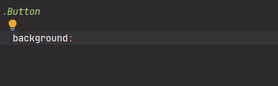

# FlatUI_Colors - Material Design Colors palette

[](https://plugins.jetbrains.com/plugin/17677-yamato-daiwa-frontend)



Represents the first version of Flat UI Palette introduced at [https://flatuicolors.com/](https://flatuicolors.com/).
Notable by saturated, lively colors - highly recommended using if you are not have the design yet and don't know which
colors palette to use for now.

```
FlatUI_Colors.{COLOR}
```

Available **COLOR**s are:

* turquoise
* greenSea
* emerald
* nephritis
* peterRiver
* belizeHole
* amethyst
* wisteria
* wetAsphalt
* midnightBlue
* sunFlower
* orange
* carrot
* pumpkin
* alizarin
* pomegranate
* clouds
* silver
* concrete
* asbestos
