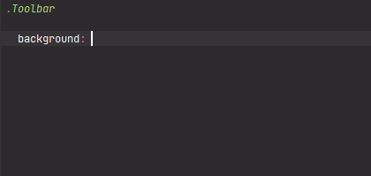

# MaterialDesignColors - Material Design Colors palette

[](https://plugins.jetbrains.com/plugin/17677-yamato-daiwa-frontend)



Represents the [color system of Material design](https://material.io/design/color/the-color-system.html#color-usage-and-palettes).  

```
MaterialDesignColors.{TONE}.{COLOR_CODE}
```

Available **TONE**s are:

* red
* pink
* purple
* deepPurple
* indigo
* blue
* lightBlue
* cyan
* teal
* green
* lightGreen
* lime
* yellow
* amber
* orange
* deepOrange
* brown
* grey
* blueGrey

Available **COLOR_CODE**s are:

* base
* P50
* P100
* P200
* P300
* P400
* P500
* P600
* P700
* P800
* P900
* A100 (Except **brown**, **grey** and **blueGrey**)
* A200 (Except **brown**, **grey** and **blueGrey**)
* A400 (Except **brown**, **grey** and **blueGrey**)
* A700 (Except **brown**, **grey** and **blueGrey**)


## Example

```stylus
.Message
  
  &__Error
    
    color: MaterialDesignColors.red.A700

    
  &__Warning
    
    color: MaterialDesignColors.amber.A700
```

Please note that in Stylus if CSS value is some value of object (hash), basically colon is required
(see [related issue](https://github.com/stylus/stylus/issues/2558) in GitHub ).
Sometimes it works without colon, but conditions are unclear.
